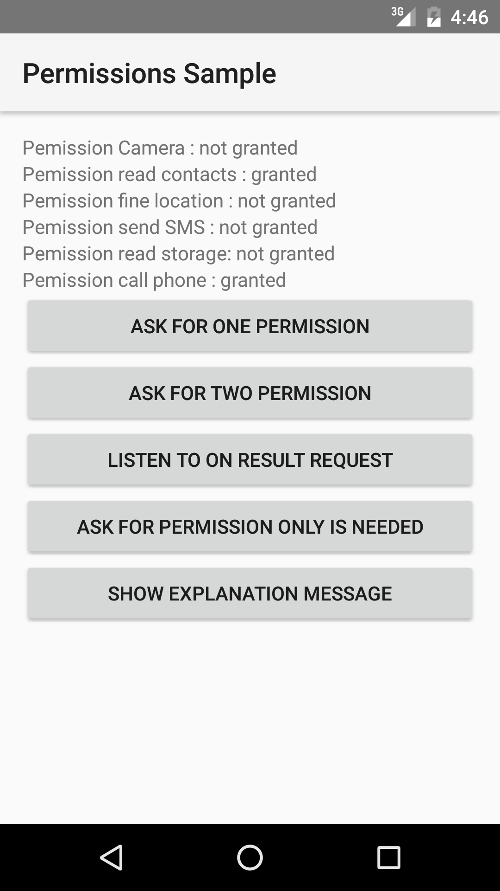
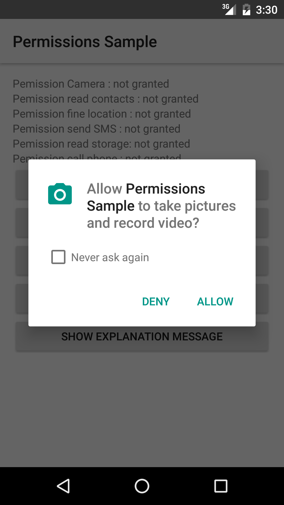
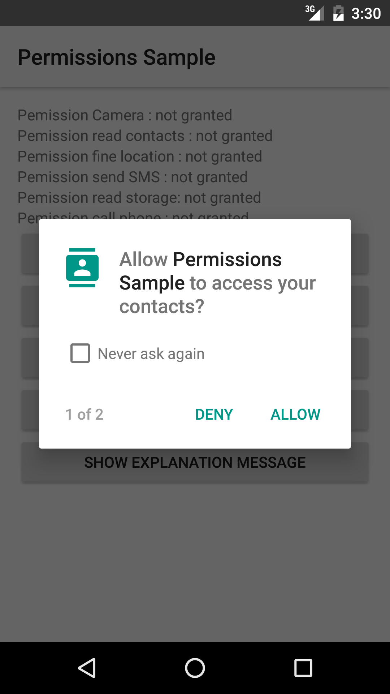
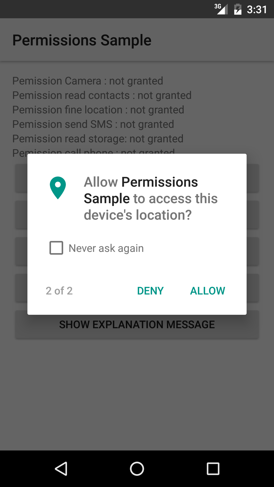
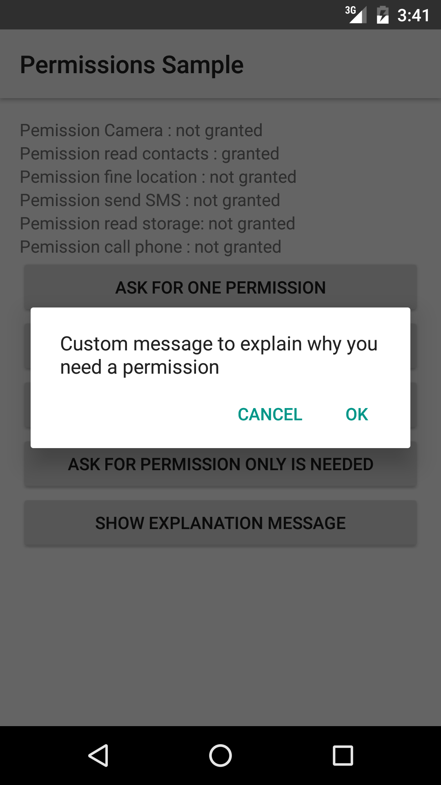

# android-permissions-sample

Sample application showing usage of new Android M Permission.

Using new methods
* ContextCompat.checkSelfPermission()
* ActivityCompat.requestPermissions()
* ActivityCompat.shouldShowRequestPermissionRationale() 

 

